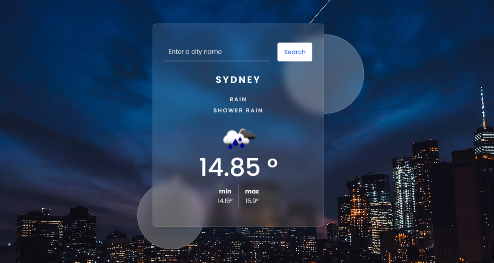

# Weather App



A simple web application that allows users to check the weather details for a specific city. This project utilizes HTML, CSS, and JavaScript to provide a user-friendly interface and fetches weather data from the OpenWeatherMap API.

## Features

- Search for weather details of any city by entering the city name.
- Display current weather conditions including temperature, weather description, and icons.
- Show minimum and maximum temperature for the day.
- Responsive design for various screen sizes.
- Stylish visual elements to enhance user experience.

## Tech Stack

- HTML
- CSS
- JavaScript
- OpenWeatherMap API

## How to Use

1. Clone the repository to your local machine:

   ```bash
   git clone https://github.com/arindal1/Weather-WebApp.git
   ```

2. Open the `index.html` file in your web browser.

3. Enter the name of the city for which you want to check the weather in the input field.

4. Click the "Search" button to fetch and display the weather details.

5. OR: Visit the Github Page to use it normally.

---

## Project Structure

- `index.html`: The main HTML file containing the structure of the web page.
- `style.css`: The CSS file that defines the styling and layout of the web page.
- `script.js`: The JavaScript file responsible for fetching weather data from the API and updating the user interface.
- `key.js`: A placeholder file where you can store your OpenWeatherMap API key
   - (currently contains my personal API key, can be replaced by your own API key when you're working on this project locally).
- `images/`: Directory containing images used in the project.

## JavaScript

The JavaScript code in this project is responsible for fetching weather data from the OpenWeatherMap API based on the city name provided by the user. It then updates the HTML content to display the fetched weather information on the webpage. Let's break down the code step by step:

```javascript
let result = document.getElementById("result");
let searchBtn = document.getElementById("search-btn");
let cityRef = document.getElementById("city");
```

- These lines of code fetch references to various HTML elements using their IDs. These elements are:
  - `result`: The HTML element where the weather details will be displayed.
  - `searchBtn`: The search button element.
  - `cityRef`: The input field where the user enters the city name.

```javascript
let getWeather = () => {
  let cityValue = cityRef.value;

  if (cityValue.length == 0) {
    result.innerHTML = `<h3 class="msg">Please enter a city name</h3>`;
  } else {
    let url = `https://api.openweathermap.org/data/2.5/weather?q=${cityValue}&appid=${key}&units=metric`;

    cityRef.value = "";
    fetch(url)
      .then((resp) => resp.json())
      .then((data) => {
        // Code to extract and display weather data
      })
      .catch(() => {
        result.innerHTML = `<h3 class="msg">City not found</h3>`;
      });
  }
};
```

- `getWeather` is a function that is triggered when the search button is clicked. It first gets the value entered in the input field.

- If the input field is empty, an error message is displayed in the `result` element indicating that a city name should be entered.

- If the input field is not empty, a URL is constructed to fetch weather data from the OpenWeatherMap API. The `key` variable is expected to be defined in the `key.js` file and contains the API key for authorization.

- The `fetch` function is used to make a GET request to the API endpoint specified by the constructed URL. It returns a promise that resolves with the response data in JSON format.

- In the `then` block, the response data is extracted and processed. The weather information is then updated in the `result` element using HTML markup.

- In case of an invalid city name or an error in fetching the data, the `catch` block is executed, and an error message is displayed in the `result` element.

```javascript
searchBtn.addEventListener("click", getWeather);
window.addEventListener("load", getWeather);
```

- These lines of code add event listeners to the search button and the window's `load` event. When the page loads or the search button is clicked, the `getWeather` function is called to fetch and display weather information.

In summary, the JavaScript code in this project handles user input, fetches weather data from an external API, processes the data, and updates the HTML content to display the weather details on the webpage. It uses event listeners to trigger actions when certain events occur (e.g., button click, page load).

---

## Customization

You can customize this project by:

- Modifying the CSS in the `style.css` file to change the visual appearance of the app.
- Adding more functionality to the JavaScript code in the `script.js` file.
- Incorporating additional features or integrating with other APIs.

## Resources

- Weather data provided by [OpenWeatherMap](https://openweathermap.org/).
- API used: [Current Weather](https://openweathermap.org/current).
- Icons from the project are sourced from the [Flaticon](https://www.flaticon.com/) website.

---

## [Weather App](https://arindal1.github.io/Weather-WebApp/)

